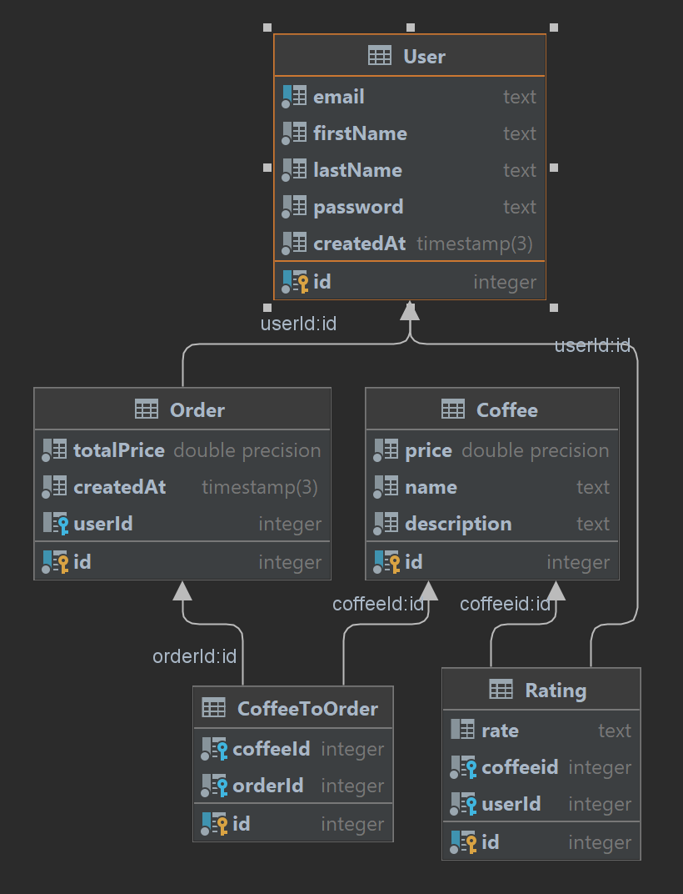

## Орлова Софья M33071
#### Тема: Создание сайта кофейни

На ERD диаграмме изображены 3 модели, которые понадобятся для реализации сайта кофейни: Заказ, Кофе и Пользователь.

Пользователь обладает параметрами:
* номер пользователя
* перечень заказов
* дата создания пользователя
* пароль
* имя
* фамилия
* почта

У кофе выделены параметры:
* цена
* название
* описание
* перечень заказов
* номер кофе

У Заказа параметры:
* конечная цена покупки
* время создания заказа
* идентификатор пользователя
* идентификатор кофе

Таблица оценки:
* текст оценки
* идентификатор пользователя
* идентификатор кофе

Также на диаграмме можно увидеть отношение моделей друг с другом. Создна дополнительная таблица, через которую осуществляется связь между заказом и кофе.

