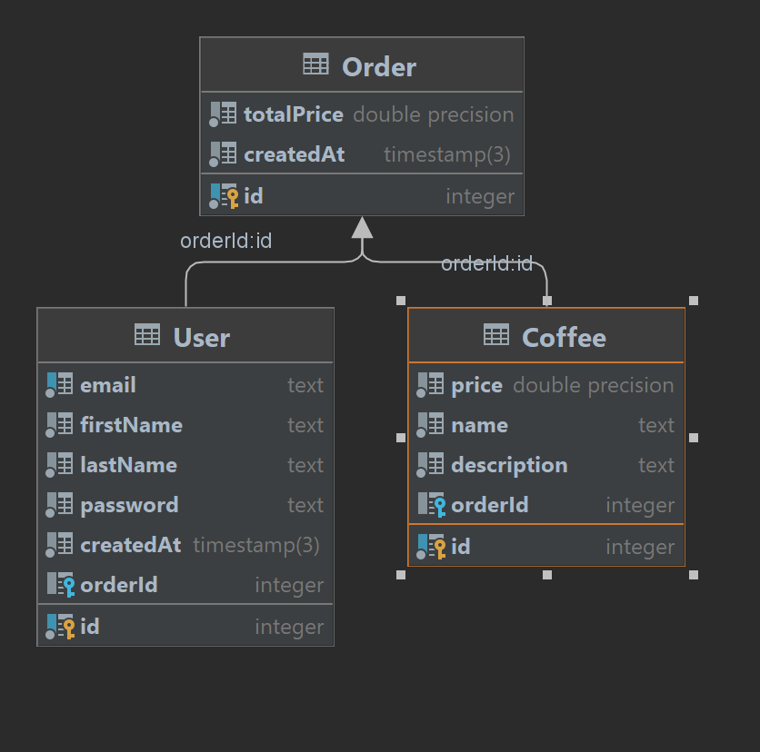

## Орлова Софья M33071
#### Тема: Создание сайта кофейни

На ERD диаграмме изображены 3 модели, которые понадобятся для реализации сайта кофейни: Заказ, Кофе и Пользователь.

Пользователь обладает параметрами:
* номер пользователя
* номер заказа
* дата создания пользователя
* пароль
* имя
* фамилия
* почта

У кофе выделены параметры:
* цена
* название
* описание
* номер заказа, в который будет добавлен кофе
* номер кофе

У Заказа параметры:
* конечная цена покупки
* время создания заказа
* номер заказа

Также на диаграмме можно увидеть отношение моделей друг с другом. Информация о кофе и пользователе входит в заказ.
